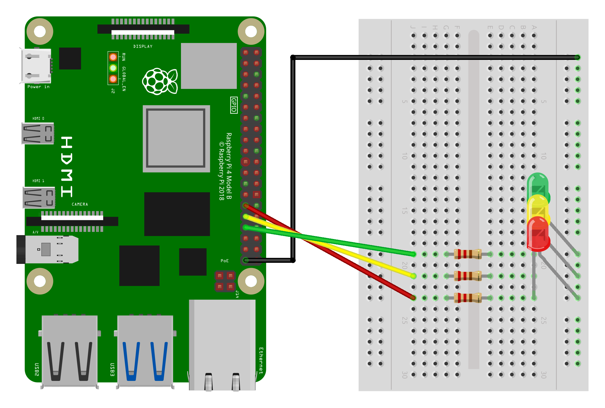

# AI robot
An AI robot running on a Raspberry Pi 4B with 8gb ram. It uses a quantized Gemma3 one billion perameter, with ollama. It has blinking lights and other cool stuff :)<br><br>


# How to install
1. Wire your Raspberry Pi like this:<br><br>


3. Install ollama:
 ```curl -fsSL https://ollama.com/install.sh | sh ```
 
4. Install the model: ```ollama pull gemma3:1b```

5. Edit the prompt in the Modelfile

6. Turn it into a model (replace my_model in chatbot.py with the name you gave it): ```ollama create my_model -f Modelfile```

7. Install eSpeak (I have it set to Swedish, change it to English by replacing "sv+m3" with "en+m3" in chatbot.py): ```sudo apt install espeak-ng```

8. Install the requierd packages: ```pip install -r requirements.txt```

9. Run chatbot.py! ```python3 chatbot.py```
